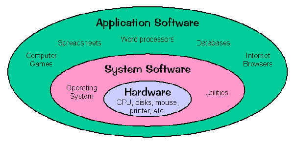
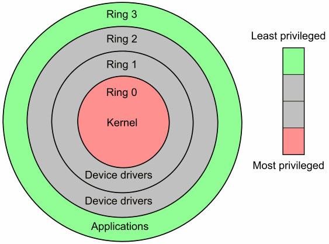
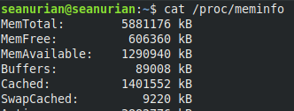

# **Weekly Logbook ~ Week-1** 

### **Table Of Content**

- [Overview](#overview)
- [Systems Programming and Application Programming](#systems-programming-and-application-programming)
  - [Definition of Systems Programming](#definition-of-systems-programming)
  - [Definition of Application Programming](#definition-of-application-programming)
- [Scripting and Programming Language](#scripting-and-programming-language)
- [Kernel](#kernel)
  - [Definition](#definition)
  - [Kernel Task](#kernel-task)
  - [Kernel & User Mode](#kernel---user-mode)
- [Program & Processes](#program---processes)
- [Proc File System](#proc-file-system)
- [Directory Path](#directory-path)
  - [Absolute Path](#absolute-path)
  - [Relative Path](#relative-path)
- [Filesystem Hierarchy Standard (FHS)](#filesystem-hierarchy-standard--fhs-)

### Overview

Pada mata kuliah *Systems Programming* ini hal yang dipelajari banyak hal yang berketerkaitan dengan mata kuliah *Operating System*, namun akan lebih ditekankan dalam pembahasan bagaimana *application*  berhubungan dengan *operating system* atau *hardware*.

Berikut topik yang dicakup pada mata kuliah ini:
- System Call
- Stat System Call
- Processor
- Memory
- stdio
- I/O Buffering
- Shells
- Signals
- GNU
- FIle Systems
- Daemon & Sockets
- Kernel Compilation
- Boot Sequences
- Kernel Module
- Device Driver

------

### Systems Programming and Application Programming

  

- #### Definition of Systems Programming
  *System programming* adalah suatu kegiatan untuk mendesain atau menulis program yang nantinya bisa menghubungkan antara *Application Program* dengan sistem.

- #### Definition of Application Programming

  *Application Programming* adalah kegiatan untuk menciptakan program yang melayani langsung pengguna agar dengan menawarkan antar muka yang enak dipandang untuk berhubungan dengan sistem operasi.

----

### Scripting and Programming Language

Kebanyakan orang beranggapan bahwa *Scripting Language* dan *Programming Language* adalah suatu hal yang sama atau bahkan dapat dikatakan hanya beda penyebutan nama saja, namu ternyata tidak demikian berikut penjelasan dari saya.

|                         Programming                          |                          Scripting                           |
| :----------------------------------------------------------: | :----------------------------------------------------------: |
| Bahasa pemrograman itu sebenarnya bahasa yang di dalamnya merupakan gabungan dari bebagai set instruksi yang ditujukan untuk menghasilkan suatu output yang spesifik | *Scripting* merupakan bahasa pemrograman juga namun digunakan sebagai pendukung yang dikhususkan untuk berjalan *runtime environment* tertentu sebagai pengotomatisan pelaksanaan suatu fungsi/perintah. |
| Bahasa pemrograman perlu dilakukan kompilasi menjadi bentuk lain oleh kompilator | Bahasa *scripting* yang ditulis dalam suatu bahasa dilakukan interpretasi oleh program yang lainnya. |
| Bahasa pemrograman didesain untuk menfasilitasi pengembangan perangkat lunak yang lebih komples | *Scripting*  didesain untuk membuat *programer* lebih mudah dan cepat dalam melakukan *coding* |
| Bahasa pemrograman relatif lebih sulit dan kompleks karena dibutuhkan barisan kode yang lumayan banyak untuk membuat suatu fungsi | *Scripting* lebih mudah karena dia hanya membutuhkan lebih sedikit baris kode karena sudah didesain untuk melakukan sesuatu yang spesifik. |

------

### Kernel

- #### Definition

  Kernel adalah suatu sistem program utama (inti) pada sistem operasi yang menjadi kunci berjalannya suatu sistem operasi karena memerankan peran penting dalam mengatur suatu sistem operasi. Yang membedakan sistem operasi dengan kernel adalah sistem operasi yang merupakan kumpulan dari beberapa program sistem sedangkan kernel merupakan program sistem yang terdapat di dalam sistem operasi.

  

- #### Kernel Task

  |  No  | Nama               | Penjelasan                                       |
  | :--: | ------------------ | ------------------------------------------------ |
  |  1   | Process Scheduling | Mengatur proses yang sedang berjalan.            |
  |  2   | Memory Management  | Mengatur penggunaan memori.                      |
  |  3   | FIle System        | Mengatur bagaimana suatu file diakses.           |
  |  4   | Access to Device   | Mengatur suatu hardware diakses.                 |
  |  5   | Networking         | Mengatur hubungan pada suatu jaringan            |
  |  6   | System Call API    | Mengatur API yang digunakan untuk akses hardware |

  

- #### Kernel & User Mode
  
  - **Kernel Mode**

    Pada *kernel mode*, eksekusi program mempunyai kendali penuh terhadap perangkat keras yang berada dibawahnya. Pada mode ini apapun instruksi yang diberikan akan dijalankan oleh CPU dan referensi alamat memori manapun akan digunakan. Biasanya pada mode ini digunakan oleh program-progam bawaan dari sistem operasi tersebut yang sudah terpercaya. Karena jika terjadi *error* atau kesalahan pada mode ini akan mengganggu keseluruhan komputer.

    

  - **User Mode**
  
    Pada *user mode* program tidak punya hak untuk secara langsung mengakses perangkat keras atau mereferensi ke suatu alamat memori seperti pada *kernel mode*. Pada mode ini semua program yang berjalan harus menggunakan sistem API untuk mengakse memori atau perangkat keras, dikarenakan adanya batasan terhadap akses perangkat keras dan memori *error* pada mode ini sebagian besar masih dapat diperbaiki lagi seperti semula. Kebanyakan aplikasi yang ada di komputer kalian berjalan di *user mode*.

------

### Program and Processes

Untuk pendefinisian *program* dan *processes* itu sangat berkaitan, definisi dari *program* adalah suatu *entity* yang bersifat pasif yang berisi sekumpulan instruksi untuk dapat melakukan suatu hal tertentu. dan seketika jika program tersebut berubah jadi aktif atau di eksekusi maka program tersebut selanjutnya disebut sebagai *process*.

Karena *process* merupakan sesuatu yang aktif (program yang berjalan) maka *process* disimpan pada *process memory*, *process memory* sendiri di bagi menjadi 4 segmen yaitu:

- **stack**   : bagian ini digunakan untuk menyimpan variabel lokal dari fungsi dan informasi ketika suatu fungsi dipanggil oleh *process*, seperti *return address*.

- **heap**   : bagian *heap* berfungsi sebagai *dynamic memory* yang berbagi dengan *process* lainnya. Biasanya digunakan untuk informasi yang sering digunakan oleh *process*.

- **text**   : bagian ini berisikan instruksi mesin yang nantinya akan dieksekusi oleh CPU.

- **data**  : menyimpan variabel global dan statis yang dialokasikan dan diinisialisasi pada kode sebelum menjalankan main. 

------

### Proc File System

Pada direktori ini terdapat *file* yang kebanyakan adalah *read-only* oleh *user* karena berisikan informasi sistem dan *process*. misal kita ingin mengecek *memory info* dengan menggunakan `/proc`.

kita bisa melihat informasi memory pada `/proc/meminfo` dengan `cat /proc/meminfo` seperti ini:

masih banyak selain `/meminfo` yang tertera di bawah ini.

- **/proc/cmdline** – informasi *command line* kernel.
- **/proc/console** – informasi tentang *console* sekarang termasuk tty.
- **/proc/devices** – informasi mengenai *device driver* yang saat ini dikonfigurasi untuk kernel.
- **/proc/dma** – informasi tentang *DMA channels* saat ini.
- **/proc/fb** – informasi *Framebuffer devices*.
- **/proc/filesystems** – informasi mengenai *filesystem* yang didukung oleh kernel.
- **/proc/meminfo** – Informasi mengenai *system memory*.
- **/proc/modules** – informasi mengenai modul kernel yang dimuat saat ini.
- **/proc/mounts** – daftar semua *mount* yang digunakan oleh sistem.
- **/proc/partitions** – Informasi terperinci tentang partisi yang tersedia untuk sistem.
- **/proc/uptime** – informasi waktu *uptime* (dalam detik).
- **/proc/version** – infromasi versi kernel, versi gcc, dan distribusi Linux yg diinstal.

dan lainnya yang tidak bisa di jelaskan satu persatu, atau bisa menjalankan *command* `man proc` untuk melihat lebih lengkapnya.

------

### Directory Path

Suatu urutan posisi dimana *file* yang di organisasikan oleh *file system* diletakan. misalnya `/home/user/.ssh/known_hosts` itu menandakan file *known_hosts* berlokasi pada posisi tersebut. Selanjutnya dikenal juga istilah *Absolute* dan *Relative* *path*.

- #### Absolute Path

  *path* yang menuju ke suatu lokasi yang beracuan terhadap *root directory* (/), contohnya ketika melakukan `cat` *command* ,`cat /home/user/.ssh/known_hosts`.

- #### Relative Path

  *path* yang beracuan terhadap *working directory* saat ini (bisa dilihat dengan`pwd`), misal kita sedang berada pada *directory* `/home/user/.ssh`, maka *command* yang sama akan seperti ini, `cat known_hosts`.

------

### Filesystem Hierarchy Standard (FHS)

Pada suatu sistem operasi pasti *directory*-nya dikelola menggunakan suatu sistem, dan pada linux sistem tersebut adalah *hierarchy tree* yang bernama *Filesystem Hierarchy Standard* (FHS), dikelola oleh Linux Foundation dengan versi terakhir 3.0 yang dirilis pada 3 Juni 2015. FHS ini mengatur struktur dan konten dari *directory* pada sistem operasi linux, biasanya strukturnya berbentuk *hierarchical tree structure*, yang cara kerjanya yaitu *directory* sebelumnya merupakan *parent* dari *directory* sekarang dan *directory* yang bisa di akses selanjutnya melalui *directory* sekarang merupakan *child*-nya. Pada FHS ini semua *directory* berada di bawah *root directory* yaitu `/` (*slash*) seperti `bin`, `boot`, `etc`, `home`, `usr`. Namun terkadang ada beberapa distribusi yang menambahkan sesuai kebutuhannya masing-masing.

------

