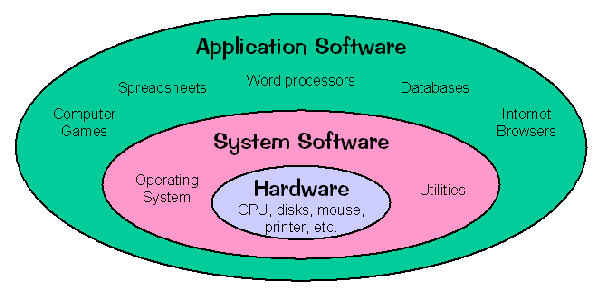

# **Weekly Logbook ~ Week-1** 

### Overview.
Pada mata kuliah *Systems Programming* ini hal yang dipelajari banyak hal yang berketerkaitan dengan mata kuliah *Operating System*, namun akan lebih ditekankan dalam pembahasan bagaimana *application*  berhubungan dengan *operating system* atau *hardware*.

Berikut topik yang dicakup:
- System Call
- Stat System Call
- Processor
- Memory
- stdio
- I/O Buffering
- Shells
- Signals
- GNU
- FIle Systems
- Daemon & Sockets
- Kernel Compilation
- Boot Sequences
- Kernel Module
- Device Driver

------

### Systems Programming & Application Programming.

  

- #### Definition of Systems Programming
  *System programming* adalah suatu kegiatan untuk mendesain atau menulis program yang nantinya bisa menghubungkan antara *Application Program* dengan sistem.

- #### Definition of Application Programming

  *Application Programming* adalah kegiatan untuk menciptakan program yang melayani langsung pengguna agar dengan menawarkan antar muka yang enak dipandang untuk berhubungan dengan sistem operasi.

----

### Scripting & Programming Language.

Kebanyakan orang beranggapan bahwa *Scripting Language* dan *Programming Language* adalah suatu hal yang sama atau bahkan dapat dikatakan hanya beda penyebutan nama saja, namu ternyata tidak demikian berikut penjelasan dari saya.

|                         Programming                          |                          Scripting                           |
| :----------------------------------------------------------: | :----------------------------------------------------------: |
| Bahasa pemrograman itu sebenarnya bahasa yang di dalamnya merupakan gabungan dari bebagai set instruksi yang ditujukan untuk menghasilkan suatu output yang spesifik | *Scripting* merupakan bahasa pemrograman juga namun digunakan sebagai pendukung yang dikhususkan untuk berjalan *runtime environment* tertentu sebagai pengotomatisan pelaksanaan suatu fungsi/perintah. |
| Bahasa pemrograman perlu dilakukan kompilasi menjadi bentuk lain oleh kompilator | Bahasa *scripting* yang ditulis dalam suatu bahasa dilakukan interpretasi oleh program yang lainnya. |
| Bahasa pemrograman didesain untuk menfasilitasi pengembangan perangkat lunak yang lebih komples | *Scripting*  didesain untuk membuat *programer* lebih mudah dan cepat dalam melakukan *coding* |
| Bahasa pemrograman relatif lebih sulit dan kompleks karena dibutuhkan barisan kode yang lumayan banyak untuk membuat suatu fungsi | *Scripting* lebih mudah karena dia hanya membutuhkan lebih sedikit baris kode karena sudah didesain untuk melakukan sesuatu yang spesifik. |

------

### Kernel.

- #### Definition

  Kernel adalah suatu sistem program utama (inti) pada sistem operasi yang menjadi kunci berjalannya suatu sistem operasi karena memerankan peran penting dalam mengatur suatu sistem operasi. Yang membedakan sistem operasi dengan kernel adalah sistem operasi yang merupakan kumpulan dari beberapa program sistem sedangkan kernel merupakan program sistem yang terdapat di dalam sistem operasi.

  

- #### Kernel Task

  |  No  | Nama               | Penjelasan                                       |
  | :--: | ------------------ | ------------------------------------------------ |
  |  1   | Process Scheduling | Mengatur proses yang sedang berjalan.            |
  |  2   | Memory Management  | Mengatur penggunaan memori.                      |
  |  3   | FIle System        | Mengatur bagaimana suatu file diakses.           |
  |  4   | Access to Device   | Mengatur suatu hardware diakses.                 |
  |  5   | Networking         | Mengatur hubungan pada suatu jaringan            |
  |  6   | System Call API    | Mengatur API yang digunakan untuk akses hardware |

  

- #### Kernel & User Mode
  
  - **Kernel Mode**

    Pada *kernel mode*, eksekusi program mempunyai kendali penuh terhadap perangkat keras yang berada dibawahnya. Pada mode ini apapun instruksi yang diberikan akan dijalankan oleh CPU dan referensi alamat memori manapun akan digunakan. Biasanya pada mode ini digunakan oleh program-progam bawaan dari sistem operasi tersebut yang sudah terpercaya. Karena jika terjadi *error* atau kesalahan pada mode ini akan mengganggu keseluruhan komputer.

    

  - **User Mode**
  
    Pada *user mode* program tidak punya hak untuk secara langsung mengakses perangkat keras atau mereferensi ke suatu alamat memori seperti pada *kernel mode*. Pada mode ini semua program yang berjalan harus menggunakan sistem API untuk mengakse memori atau perangkat keras, dikarenakan adanya batasan terhadap akses perangkat keras dan memori *error* pada mode ini sebagian besar masih dapat diperbaiki lagi seperti semula. Kebanyakan aplikasi yang ada di komputer kalian berjalan di *user mode*.

------

