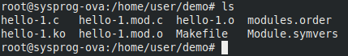
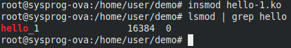
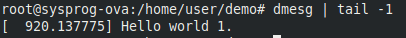
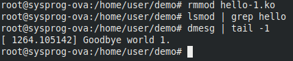

# **Weekly Logbook ~ Week-13**

- [Module](#module)
- [Driver](#driver)
- [Relation between Module and Driver](#relation-between-module-and-driver)
  * [Type of module](#type-of-module)
- [Device](#device)
- [Create a simple Kernel Module](#create-a-simple-kernel-module)

### Module

------

**module** adalah sebuah kode yang dapat dipasang dan dilepas kepada kernel sesuai keinginan pengguna. Sehingga membuat **module** dapat menambahkan sebuah fungsionalitas kepada kernel tanpa perlu me-*reboot*.  Salah satu jenis **module** ada device **driver**.

### Driver

------

Seperti telah dijelaskan sebelumnya driver merupakan salah satu jenis dari module, lebih tepatnya driver adalh sebuah code yang membuat kernel dapat berkomunikasi dengan device. Dengan adanya Driver Module ini maka kita dapat menghindari membuat suatu kernel monolithic besar.

### Relation between Module and Driver

------

- #### Type of module

  - **Static Kernel Module**

    ini merupakan module yang terpasang ketika kernel dicompile, jadi module static merupakan bagian dari kernel itu sendiri dan begitu dicompile akan membuat kernel semakin besar semakin banyak module static didalamnya.

  - **Dynamic Kernel Module**

    dynamic kernel module biasa dikenal juga sebagai **Loadable Kernel Module** (**LKM**). LKM ini merupakan sebuah module yang tidak menjadi bagian dari kernel ketika dicompile, melainkan dipasang sebagai ekstension dari kernel.

- **Driver as LKM**

  seperti yang dijelaskan sebelumnya karena driver merupakan salah satu jeni dari module, dan karena driver dapat dipasang ketika kernel sedang berjalan tanpa perlu melakukan re-*boot* maka lebih spesifiknya driver merupakan Dynamic Kernel Module atau LKM.

### Device

------

pada linux device diperlakukan layaknya file, dan biasanya dapat ditemukan dibawah directory `/dev`. File-file tersebut termasuk file spesial yang tidak seperti file pada umumnya dan memiliki jenisnya masing-masing. Jenis yang paling banyak biasanya adalah **character device** dan **block device**.

- **Character Device**

  merupakan device yang drivernya berkomunikasi dengan mengirim dan menerima single character (byte). contohnya adalah, serial ports, parallel ports, sounds cards.

- **Block Device**

  merupakan device yang drivernya berkomunikasi dengan mengirim dan menerima block of data (bytes). contohnya adalah, hard disks, USB cameras, Disk-On-Key.

### Create a simple Kernel Module

------

> Silahkan baca lebih lengkap source dari code dibawah ini [disini](https://tldp.org/LDP/lkmpg/2.6/html/lkmpg.html#AEN40).


```c
/*  
 *  hello-1.c - The simplest kernel module.
 */
#include <linux/module.h>	/* Needed by all modules */
#include <linux/kernel.h>	/* Needed for KERN_INFO */

int init_module(void)
{
	printk(KERN_INFO "Hello world 1.\n");

	/* 
	 * A non 0 return means init_module failed; module can't be loaded. 
	 */
	return 0;
}

void cleanup_module(void)
{
	printk(KERN_INFO "Goodbye world 1.\n");
}
```

beri nama `hello-1.c`, kemudian buat sebuah `Makefile` untuk mempermudah kompilasi dan cleanning seperti berikut.

```makefile
obj-m += hello-1.o

all:
	make -C /lib/modules/$(shell uname -r)/build M=$(PWD) modules

clean:
	make -C /lib/modules/$(shell uname -r)/build M=$(PWD) clean
```


Selanjutnya jika sudah maka tinggal jalankan `make` sebagai `root`.

- menjadi `root`

  ```bash
  sudo su
  ```

  

- melakukan `make`

  ```bash
  make
  ```

  *just type `make` on directory where Makefile and hello-1.c located.*

Jika sudah harusnya terdapat file sebagai berikut:




File `hello-1.ko` merupakan module kita yang nantinya akan dipasang.


Selanjutkan pasang module menggunakan `insmod`.

```bash
insmod hello-1.ko
```

Lalu kita cek apakah module kita sudah berjalan menggunakan `lsmod`.

```bash
lsmod | grep hello
```

Karena kita hanya ingin tahu module kita maka filter output `lsmod` menggunakan `grep`.

Hasilnya akan terlihat seperti ini:



Dapat juga dilakukan pengecekan dengan `dmesg` untuk melihat log yang dibuat menggunakan `printk`.




kemudian untuk melepas module gunakan `rmmod`.

```bash
rmmod hello-1.ko
```

dan cek kembali `lsmod` dan `dmesg`.

