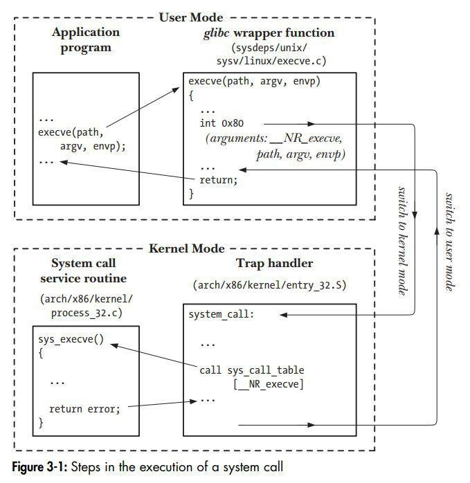

# **Weekly Logbook ~ Week-2** 

### What is System Call

- [What is System Call](#what-is-system-call)
  * [What is System Call](#what-is-system-call-1)
  * [Role of System Call](#role-of-system-call)
  * [Example of System Call](#example-of-system-call)
- [Performing a System Call](#performing-a-system-call)
  * [Library Function](#library-function)
  * [Error Handling](#error-handling)
  * [Example Error Code](#example-error-code)

- #### What is System Call

  *System Call* adalah suatu program yang digunakan oleh *application program* untu dapat berkomunikasi dengan *system program* sehingga keperluan akan data atau *device* akan dapat terpenuhi dan terbagi secara adil pada semua *process*.

- #### Role of System Call

  Kita tahu bahwa suatu sistem paling tidak terdapat 2 mode yaitu *user mode* dan *kernel mode*. kedua mode ini memiliki perbedaan terhadap hak akses ke perangkat keras dari suatu sistem, sehingga dibutuh kan perantara yang memungkinkan agar kedua mode ini dapat berkomunikasi maka hadir lah *system call*. *System Call* ini yang berada diantara *user mode* dan *kernel mode* istilahnya sebagai penerjemah dua arah.

- #### Example of System Call

  - `open()`, membuka file jika ingi digunakan.

  - `read()`, membaca data dari suatu file.

  - `write()`, menuliskan data kedalam suatu file.

  - `close()`, untuk menutup file ketika selesai menggunakannya.

------

### Performing a System Call

*application program* memanggil sebuah fungsi yan kemudian diterukan kepada *wrapper function*, pada *wrapper function* akan disiapkan fungsi-fungsi yang berkaitan dan register-register yang dibutuhkan nantinya. Lalu dilakukan *switching* dari *user mode* ke *kernel mode* yang dilakukan oleh *Trap Handler* pada fase ini akan dikelola agar fungsi-fungsi yang dipanggil agar dapat dimengerti oleh *System call service routine*. Setelah selesai data dari *system call service routine* akan diubah kembali oleh *Trap Handler* untuk diteruskan kepada *wrapper function* sekaligus *switching* dari *kernel mode* ke *user mode*. *wrapper function* akan mengola data yang diberikan oleh *trap handler* untuk ditampilkan kepada user.

- #### Library Function

  Jika ingin melakukan pemanggilan *system call* disarankan agar untuk menggunakan *Library function* dari pada langsung memanggil fungsi *system call* tersebut, karena pada Library Function juga memanfaatkan system call yang lebih effisien. Maksudnya effisien adalah jika kita melakukan pemanggilan *system call* dengan *Library Function* maka kita bisa memanfaatkan fungsi yang ada pada kernel tanpa harus berpindah ke *kernel mode* sedangkan jika langsung memanggil *system call* tanpa menggunakan *Library Function* akan memerlukan waktu untuk *switching* *user mode* ke *kernel mode*.

- #### Error Handling

  Setiap melakukan pemanggilan *system call* tidak akan selalu berhasil alias bisa terjadi *error* sehingga kita perlu menanganinya, untuk menandai *error* maka setiap pemanggilan *system call* yang gagal (*error*) akan mengembalikan angka yang menandakan *error* apa yang terjadi. Kita bisa melihat jenis-jenis *error* pada file errno.h. 

  Beberapa fungsi ketika berhasil akan tetap mengembalikan -1 jadi kita perlu untuk mengakalinya dengan mengeset *errno* menjadi 0 sehingga jika errno berubah kita tahu bahwa tidak terjadi *error* dalam pemanggilannya.

- #### Example Error Code

  | ERROR CODE | NUMBER | DESC                      |
  | ---------- | ------ | ------------------------- |
  | **EPERM**  | 1      | Operation not permitted   |
  | **ENOENT** | 2      | No such file or directory |
  | **ESRCH**  | 3      | No such process           |
  | **EINTR**  | 4      | Interrupted system call   |

  dan lainnya bisa dicek pada file errno.h

------

