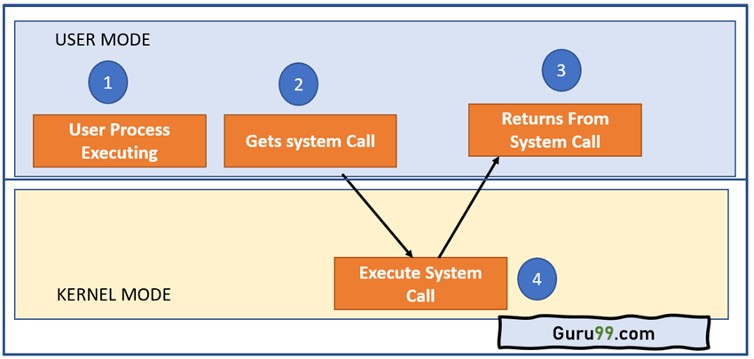

# **Weekly Logbook ~ Week-2** 

### System Call

- #### What is System Call

  *System Call* adalah suatu program yang digunakan oleh *application program* untu dapat berkomunikasi dengan *system program* sehingga keperluan akan data atau *device* akan dapat terpenuhi dan terbagi secara adil pada semua *process*.

- #### Role of System Call

  Kita tahu bahwa suatu sistem paling tidak terdapat 2 mode yaitu *user mode* dan *kernel mode*. kedua mode ini memiliki perbedaan terhadap hak akses ke perangkat keras dari suatu sistem, sehingga dibutuh kan perantara yang memungkinkan agar kedua mode ini dapat berkomunikasi maka hadir lah *system call*. *System Call* ini yang berada diantara *user mode* dan *kernel mode* istilahnya sebagai penerjemah dua arah.

- #### Example of System Call

  - `open()`, membuka file jika ingi digunakan.

  - `read()`, membaca data dari suatu file.

  - `write()`, menuliskan data kedalam suatu file.

  - `close()`, untuk menutup file ketika selesai menggunakannya.

------

​    

