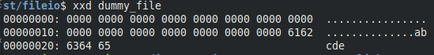

# **Weekly Logbook ~ Week-3** 

### Stat System Call

- #### Description

  Fungsi ini berfungsin untuk mendapatkan status dari sebuah *file*, terdapat juga yang mirip selain `stat()`, yaitu `fstat()` dan `lstat()`.  Cara kerjanya `stat()` adalah mengambil informasi yang ada pada *inode* dari *file* yang bersangkutan dan menaruhnya pada *stat structure* yang menyimpan beberapa informasi. `stat()` ketika selesai dijalankan akan mengambalikan 0 jika sukses, sedangkan -1 jika terjadi sebuah error.

- #### Stat Structure

  ```c
  struct stat {
    	mode_t     		st_mode;
    	ino_t     		st_ino;
    	dev_t     		st_dev;
    	dev_t     		st_rdev;
    	nlink_t    		st_nlink;
    	uid_t     		st_uid;
    	gid_t     		st_gid;
   	off_t     		st_size;
    	struct timspec 	st_atim;
    	struct timspec 	st_mtim;
    	struct timspec 	st_ctim;
    	blksize_t   	st_blksize;
    	blkcnt_t    	st_blocks;
   };
  ```
  
  keterangan:
  
  - **st_mode**, berisi *permission* sebuah file.
  - **st_ino**, berisi angka *inode*.
  - **st_dev**, id dari *device* tempat file berada.
  - **st_rdev**, id dari *device* jika merupakan *file* spesial. 
  - **st_nlink**, jumlah angka dari *hard link*.
  - **st_uid**, User ID dari pemilik file.
  - **st_gid**, Group ID dari pemilik file.
  - **st_size**, ukuran *file* dalam *bytes*.
  - **st_atime**, waktu terakhir *file* diakses.
  - **st_mtime**, waktu terakhir *file* diubah.
  - **st_ctime**, waktu terakhir *file* diganti *permission*-nya.
  - **st_blksize**, ukuran *block* untuk I/O.
  - **st_blocks**, total *block* kelipatan 512 *bytes*.
  
- #### lstat() and fstat()

  - `lstat()` sama-sama mengembalikan info mengenai file, namun jika file tersebut adalah *symbolic link* `lstat()` akan mengembalikan info mengenai file itu sendiri dan bukan file yang ditujuk.
  - `fstat()` mengambil informasi dari suatu *file* namun hanya bisa *file* yang di spesifikasi oleh *file descriptor*.

------

### Inode

- #### Description

  *Inode* adalah sebuah angka yang berfungsi sebagai *index* pada suatu *file system* yang berisi sebuah informasi seperti pemilik, *permissions* dan atribut lainnya pada suatu *file*.

- #### Inode Table

  Untuk mengatur kumpulan *inode* tersebut suatu *file system* membutuhkan yang namanya *inode table.* Karena itu *inode Table* merupakan kumpulan  inode number berada yang berisi info mengenai jumlah  inode  maksimum, yang digunakan dan  inode yang masih tersisa. Penambahan isi dari  inode table dilakukan ketika suatu file system pertama kali dibuat.

 

------

### File Descriptor

File Descriptor  merupakan sebuah angka non-negatif yang menandai sebuah  open file dan bagaimana mengaksesnya yang ada pada suatu operating system. Suatu *file descriptor* dibuat ketika suatu *process* memanggil *system call* *open* untuk membuka suatu *file*, *file descriptor* tersebut berfungsi sebagai pointer terhadap *file* yang dimaksud.

- #### Overloaded File Descriptor

  Karena *file descriptor* merupakan suatu angka maka pasti tentu ada batasan terhadap *file descriptor* yang dapat digunakan. maka kita harus menutup *file* tersebut agar *file descriptor* yang digunakan dapat bebas lagi.

------

### File Holes

Sebuah file ketika dimasukan sebuah data maka setiap data selalu urut mulai dari *offset* 0 dan seterusnya hingga ukuran *file*. namun bisa saja kita membuat loncatan *offset* sehingga ada bagian dari file yang tidak memiliki data (ditulis sebagai 0), bagian ini disebut sebagai *file holes*.



------

