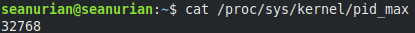

# **Weekly Logbook ~ Week-4** 

- [Process Program and Thread](#process-program-and-thread)
  * [Thread](#thread)
  * [Relation Between Process Program and Thread](#relation-between-process-program-and-thread)
- [Process ID](#process-id)
  * [PID Maximum Number](#pid-maximum-number)
  * [Out of PID Number](#out-of-pid-number)
- [PS command](#ps-command)
  * [Some Usefull option](#some-usefull-option)
- [Process State](#process-state)
  * [Types of Process States](#types-of-process-states)
- [Variety of Process](#variety-of-process)
  * [Zombie Process](#zombie-process)
  * [Orphaned Process](#orphaned-process)
  * [Daemon Process](#daemon-process)

### Process Program and Thread

Pada week sebelumnya telah dipejalari mengenai *Procees* dan *Program*, pada kali ini saya akan menjelaskan 1 hal lagi yaitu *Thread*.

- #### Thread

  Thread  adalah sebuah unit eksekusi yang berada di dalam sebuah  process . Tugasnya adalah untuk menjalankan instruksi-instruksi pada sebuah  process.

- #### Relation Between Process Program and Thread

  Kita sudah mengetahui bahwa hubungan antara *process* dan *program*, yaitu *process* merupakan *program* yang sedang berjalan. Lebih lanjut lagi sebuah sebuah *program* dapat memiliki *copy* dirinya dan berjalan di lebih dari 1 *process*, namun sebaliknya 1 *process* hanya dapat memiliki tepat 1 program yang berjalan didalamnya. Kemudian *thread* juga memiliki hubungan dengan *process*, yaitu *thread* bertugas mengeksekusi instruksi yang berada di dalam *process*, pada umumnya *thread* yang ada pada *process* terdiri lebih dari 1 thread.

------

### Process ID

Process ID atau biasa disebut PID merupakan sebuah angka unik yang berikan kepada suatu *process* agar sistem dapat mengidentifikasi *process* tersebut. 

#### PID Maximum Number

karena disebutkan PID adalah sebuah angka yang unik muncul pertanyaan pasti PID memiliki nilai maksimal dan tidak mungkin tak hingga. Kita dapat mengetahui nilai maksimal dari PID dengan menggunakan *command* `cat /proc/sys/kernel/pid_max`



Linux 32-bit nilai maksimal dari PID adalah 32768 tapi bagi yang menggunakan 64-bit maka nilai tersebut dapat ditulis ulang hingga 2<sup>22</sup> atau 4194304.

#### Out of PID Number

jika setiap *process* menggunakan PID unik yang diberikan untuk dirinya apa yang terjadi jika semua angka pada PID telah digunakan. Karena cara kerja pada PID adalah dengan cara menaikan terus angka lalu diberikan kepada *process* baru maka setiap mencapai nilai maksimal maka PID akan kembali reset ke angka 301 karena PID 300 kebawah manjadi PID cadangan ([see here](https://github.com/torvalds/linux/blob/c85fb28b6f999db9928b841f63f1beeb3074eeca/kernel/pid.c#L63)). Kemudian bagaimana jika semua PID benar-benar digunakan oleh *process* dan tidak tersisa satupun PID yang bebas. Maka pembuatan *process*  baru akan mengalami kegagalan sehingga tidak terbuat *process* baru hingga ada PID yang di bebaskan.

------

### PS command

Pada sistem operasi linux terdapat sebuah *command* `ps` yang merupakan singkatan dari *process status* yang gunanya untuk membuat daftar process dan PID yang ada pada sistem kita. Info yang ditampilkan biasanya berupa PID, PPID dan COMMAND tergantung dari `ps [option]` yang kita gunakan.

#### Some Usefull option

- ```bash
  ps -fU <user>
  ```

  *option* ini akan menampilkan *process*  yang dijalankan oleh `<user>` saja.

  

- ```bash
  ps -f --ppid <1,2,..>
  ```

  *option* ini akan menampilkan semua *process* yang dimiliki PPID yang disebutkan dalam daftar tersebut.

  

- ```bash
  ps -e --forest
  ```

  *option* ini akan menampilkan struktur *parent* dan *child* dengan visual seperti *tree* untuk seluruh *process*.

  

------

### Process State

suatu process yang ada pada suatu sistem tidak hanya terus dalam keadaan berjalan dan keadaan *process* pada saat itu disebut dengan *process state*.

- #### Types of Process States

  - **Uninterruptible Sleep**

    *State* ini adalah dimana *process* sedang menunggu *system call* untuk selesai sehingga tidak dapat dimatikan.

  - **Running**

    *State* dimana sebuah process yang sedang menjalankan tugasnya.

  - **Waiting**

    Suatu *process* akan memasukin *state* ini jika *process* tersebut sedang menunggu sebuah *trigger* bisa jadi *process* lain.

  - **Stopped**

    Sebuah process yang sudah selesai atau berhenti karena mengalami error dan sudah dimatikan dan dihapus dari memori.

  - **Zombie**

    Sebuah process yang sebenarnya sudah mati tetapi masih menggunakan resource dari sistem karena *parent*-nya tidak mengahapusnya dari memori.

------

### Variety of Process

- #### Zombie Process

  *zombie process* merupakan sebuah *process* yang sebenarnya telah dimatikan namun belum sepenuhnya dihapus dari memori. Hal ini dapat terjadi karena *parent* dari *zombie process* ini tidak diprogram untuk menghapus sisa-sisa *process* yang tersebut sehingga tetap terdaftar pada PID.

- #### Orphaned Process

  seperti namanya *orphaned process* adalah *process* yang tidak memiliki parent dikarenakan *parent*-nya telah selesai terlebih dahulu sebelum menunggu *child*-nya.

- #### Daemon Process

  *daemon process* adalah sebuah *process* namun *process* ini terus berjalan sejak *init* pada background yang nantinya berfungsi sebagai *service* .

  ------

  

